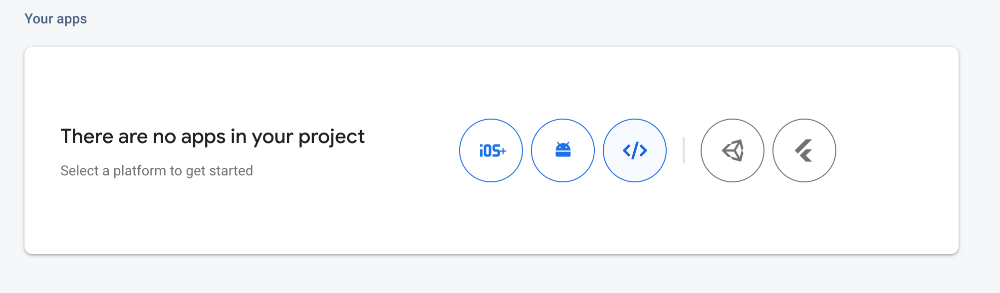
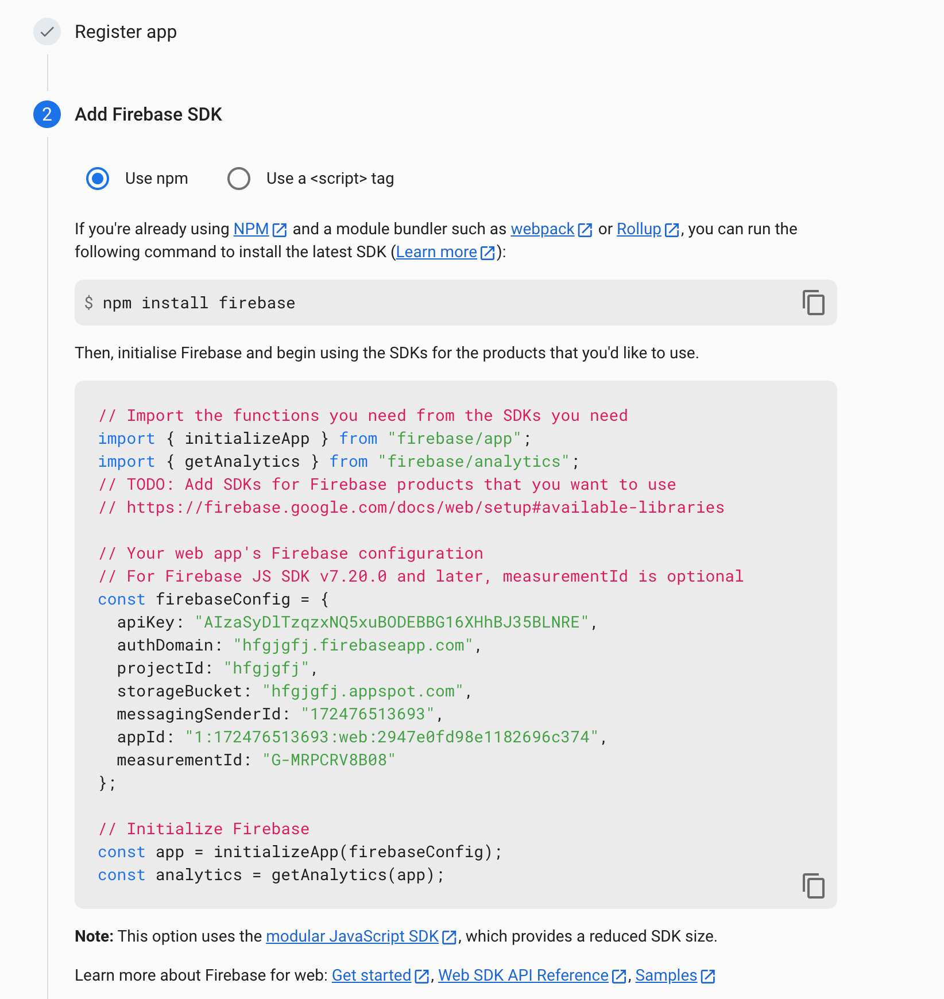
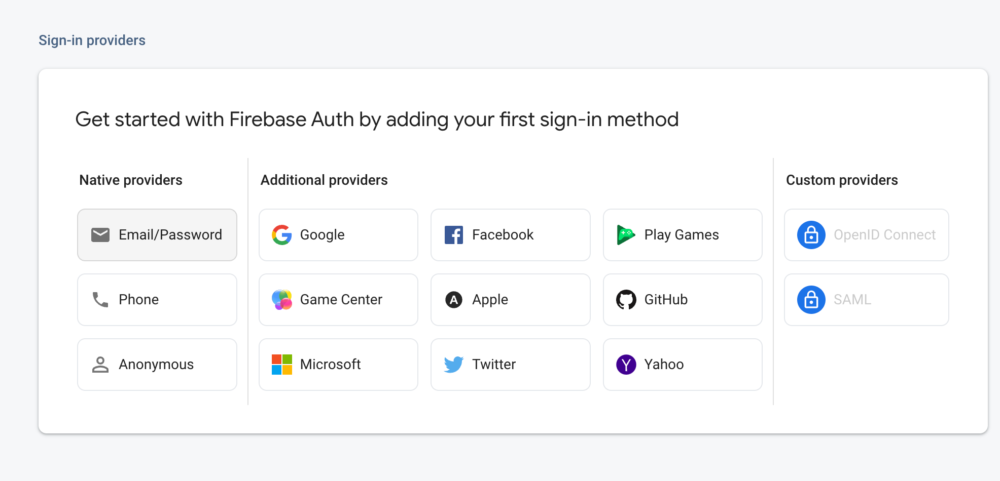

# Password Manager

This project has for purpose to save all your passwords crypted in firbase.

It was generated with [Angular CLI](https://github.com/angular/angular-cli) version 16.0.2.

## Install the app

Download the source code and then do npm install

## Development server

Run `ng serve` for a dev server. Navigate to `http://localhost:4200/`.

The application will automatically reload if you change any of the source files.

## Work with firebase

Create an account in Firebase.

In project Overview , Add app  choose the web one
And follow the follwing steps like below

Copy the generated file to your environements files .

Under Authentification  activate email/password mechanism and then add User to be able to login in your application.

## Demo

Go to https://mhj-password-manager.web.app

* User: test@gmail.com

* Password: 123456

## Support

If you need support please contact me at **jabranemohamed@gmail.com** **_(free)_**
